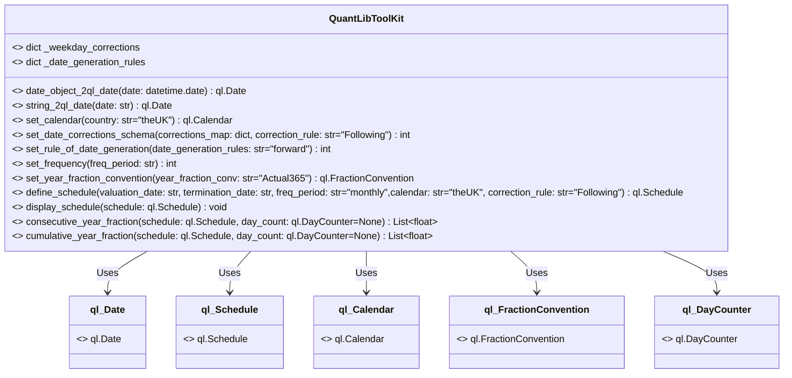
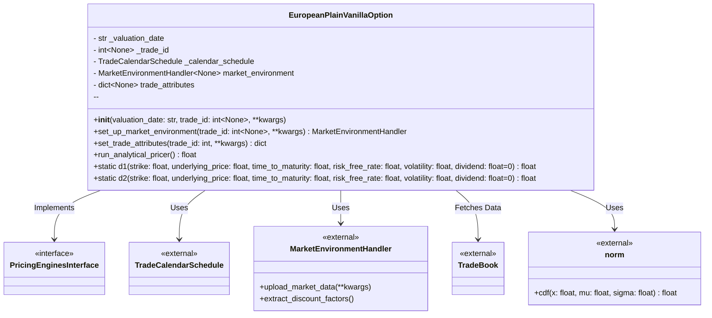
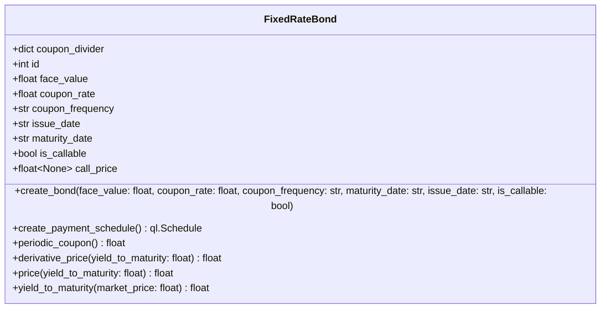

# Numeraire library

The application's aim is to provide a comprehensive set of tools to help in different aspect of pricing  derivative product
Additional module provides that provides also extra module for sensitivity analysis. 

#### Table of contents
[Installation](#Instalation)  
[Project Structure](#ProjectStructure)  
[General Overview](#GeneralOverview)  
[Configuration](#Configuration)  
[Underlier Simulation](#UnderlierSimulation)  
[Black-Scholes Pricing Framework](#BlackScholesPricingFramework)  
[Sensitivity Analysis](#SensitivityAnalysis)  
[Utils](#Utils)  

## Installation
To use the package you need to clone the repository first. The package itself has a numerous dependencies, and it is
better to isolate environment for this module. 
## Dependencies
To run the code smoothly a User must first import QuantLib library and Django Tailwind. From QuantLib we leverage only calendar 
schedule and lifecycle of trades. Django provides framework for FrondEnd. All analytical formula are implemented from
scratch.

## Structure
```
📂 .git
📂 .idea
📂 __pycache__
📄 app_settings.py
📂 base
  📄 __init__.py
  📄 asgi.py
  📄 settings.py
  📄 urls.py
  📄 wsgi.py
📂 bond_forge
  📄 __init__.py
  📄 admin.py
  📄 apps.py
  📄 models.py
  📄 tests.py
  📄 views.py
📂 jupyter
📄 main.py
📄 manage.py
📂 static
📂 templates
📂 tests
  📄 __init__.py
  📄 test_analytic_pricing.py
  📄 test_bonds.py
  📄 test_fundamentals.py
📂 theme
  📄 __init__.py
  📄 apps.py
📂 tool_kit
  📂 __pycache__
  📄 config_loader.py
  📄 fundamentals.py
  📄 market_data_extractor.py
  📄 numerical_methods.py
  📄 plots.py
  📄 probability.py
  📄 quantlib_tool_kit.py
📂 venv
📂 wiener
  📄 __init__.py
  📂 __pycache__
  📄 admin.py
  📄 apps.py
  📄 forms.py
  📂 migrations
    📄 0001_initial.py
    📄 0002_alter_tradebook_payoff.py
    📄 0003_alter_tradebook_strike.py
    📄 __init__.py
    📂 __pycache__
  📄 models.py
  📂 src
    📄 __init__.py
    📂 __pycache__
    📄 pricing_environment.py
    📂 wiener
      📄 __init__.py
      📂 __pycache__
      📂 black_scholes_framework
        📄 __init__.py
        📂 __pycache__
        📄 pricer.py
        📄 sensitivity_analysis.py
        📄 underlier_modeling.py
      📂 stochastic_volatility
        📄 __init__.py
        📄 heston.py
  📂 static
    📂 wiener
  📂 templates
    📂 wiener
  📄 tests.py
  📄 urls.py
  📄 views.py
```
## App launching
To run application first run following command in terminal

```
python manage.py tailwind start

```

Then we run django dev server by running command:
```
python manage.py runserver

```

# YahooData Extractor
## Overview
The MarketDataExtractor class is a Python utility designed for extracting financial data from Yahoo Finance. This class is particularly useful for financial analysts, data scientists, and developers working with historical market data. Below is an overview of its functionality and design.

## Key futures
### 1. Initialization:

The class is initialized with the following parameters:

 * ```tickers```: A single ticker (string) or a list of tickers (e.g., "TSLA" or \["AAPL", "GOOG"]).

* ```start_period```: The start date for data extraction (in "YYYY-MM-DD" format).

* ```end_period```: The end date for data extraction. If set to "newest", the class retrieves the latest available price.

### 2. Data Extraction:

* The ```extract_data``` method dynamically adapts to handle different scenarios:

* Multiple Tickers: Loops through the tickers and downloads their data over the specified date range.

* Single Ticker with Time Stamp: Retrieves the price for a specific day or the newest available price since the start date.

* The extracted data is stored in a dictionary, where each key is a ticker, and the value is either a DataFrame or a specific price.

### 3. Analysis and Reporting:

* The class provides static methods for basic descriptive and structural analysis of the data:

* ```df_info```: Displays statistical summaries like mean, standard deviation, and percentiles.

* ```basic_statistic```: Outputs column-level metadata, aiding in data integrity checks.

## Possible Improvements
*	 Add support for additional columns or metrics (e.g., volume, high, low).
*	 Extend error handling to address edge cases, such as invalid tickers or missing data.
*	 Provide built-in visualization options for extracted time series data.
* Integrate caching mechanisms to avoid redundant API calls for frequently accessed data.

## Potential Applications
*  Market Analysis : Quickly retrieve and analyze historical price trends.
*  Algorithmic Trading : Use the extracted data as input for backtesting and developing trading algorithms.
*  Portfolio Management : Assess performance metrics for a set of assets over a specific time frame.
*  Academic Research : Extract and analyze financial data for research purposes.

## Summary
This class is a robust foundation for financial data extraction and serves as a useful tool for handling diverse financial datasets.

# QuantLibToolKit 
### Overview
The **QuantLibToolKit** is a utility class that provides a set of static methods for working with QuantLib’s date-related and scheduling functionalities. It simplifies the creation and manipulation of financial schedules, calendars, date adjustments, and year fractions.
### Key features include:

#### Date Conversion:
*	 Convert Python datetime.date objects or string representations into QuantLib date objects.
#### Calendar Setup:
* Define financial calendars for supported regions (e.g., USA, UK, Switzerland, Poland).
#### Date Adjustment Rules:
 *	 Apply day-count conventions to adjust invalid dates (e.g., holidays, weekends) to valid business days.
#### Frequency and Year Fraction:
*	Configure date frequencies for financial schedules (e.g., daily, monthly, quarterly).
*	Select and compute year fraction conventions (e.g., Actual/360, Actual/365).
#### Schedule Definition:
*	Create complex date schedules with options for frequency, calendars, and adjustment rules.
*	Display and compute consecutive or cumulative year fractions for a given schedule.

This class is highly modular and provides a user-friendly abstraction over QuantLib’s low-level API, making it suitable for building financial applications like bond pricing, derivative pricing, or risk management tools.

# Diagram

# European Option Pricing
## Overview
The EuropeanPlainVanillaOption class is an implementation of an analytical pricer for European plain vanilla options, based on the Black-Scholes pricing model. It handles option pricing by integrating market data, trade attributes, and analytical methods to compute the option’s fair value.
## Key Futures
#### Initialization:
* Sets up the valuation date and trade ID.
* Initializes a calendar schedule for the option’s lifecycle using a termination date.
#### Market Environment Setup:
* The set_up_market_environment method initializes the market environment by:
*	 Uploading market data.
*	Extracting discount factors required for option valuation.
#### Trade Attribute Management:
*	The set_trade_attributes method sets up the option’s parameters (e.g., underlying asset, strike price, payoff type) using either user-provided arguments or data from a trade database.
#### Black-Scholes Components:
*	Implements static methods to calculate  d_1  and  d_2 , which are core components of the Black-Scholes formula:	
    *  $$d_1 = \frac{\ln(S / K) + (r - q + \frac{1}{2} \sigma^2) \cdot T}{\sigma \sqrt{T}}$$
    *  $$d_2 = d_1 - \sigma \sqrt{T} $$,
    *  	 S : Underlying price,  K : Strike price,  r : Risk-free rate,  q : Dividend,  $\sigma$ : Volatility,  T : Time to maturity.
#### Option Valuation:
 * 	The run_analytical_pricer method computes the option price:
 *	 For a call option:
     $$C = S \cdot N(d_1) - K \cdot e^{-rT} \cdot N(d_2)$$

*	For a put option: $$P = K \cdot e^{-rT} \cdot N(-d_2) - S \cdot N(-d_1)$$
## Workflow
#### Setup:
*	Initialize the class with a valuation date and trade ID.
* 	Define market and trade attributes using set_up_market_environment and set_trade_attributes.
#### Calculation:
*	Compute  ```d_1```  and  ```d_2```  using the static methods.
*	Use the payoff type (call or put) to calculate the option price.
#### Output:
*	Returns the analytical price of the European option based on current market conditions.
## Diagram




# Bonds

## Overview
The FixedRateBond class models a fixed-rate bond, a common financial instrument that pays a periodic coupon and returns the principal at maturity. This class provides methods to define the bond’s attributes, create a payment schedule, calculate prices, and determine the bond’s yield to maturity (YTM).

## Key Features

### Initialization

#### Attributes

• ```id```: A unique identifier for the bond.

• ```face_value```: The nominal value of the bond, paid back at maturity.

• ```coupon_rate```: The annual interest rate for coupon payments.

• ```coupon_frequency```: The frequency of coupon payments (e.g., quarterly, semiannually).

• ```issue_date```: The date the bond is issued.

• ```maturity_date```: The date the bond matures.

• ```is_callable```: A boolean indicating whether the bond is callable.

• ```call_price```: The price at which the bond can be called, if applicable.
#### Bond Creation

• ```create_bond```:

- Sets the attributes of the bond based on user inputs.

- Supports callable bonds by setting a call\_price if applicable.
#### Payment Schedule
•	```create_payment_schedule```:

*	Uses QuantLib to generate a schedule of payment dates.

* Validates that the issue_date is earlier than the maturity_date.

#### Periodic Coupon Calculation

* ```periodic_coupon```:

* Calculates the coupon payment amount based on the bond’s ```coupon_rate```, ```face_value```, and ```coupon_frequency```.

Example 
•	A bond with:

    •	face_value = 1000
    •	coupon_rate = 0.05
    •	coupon_frequency = 'quarterly'
Will have a periodic coupon payment of:

$$
\text{Coupon Payment} = \frac{\text{Coupon Rate} \times \text{Face Value}}{\text{Coupon Divider}}
= \frac{0.05 \times 1000}{4} = 12.5
$$

#### Pricing and Derivatives

• ```price```:

• Computes the bond’s price given a yield to maturity (YTM).

$$P = \sum_{t=1}^{N} \frac{C}{(1 + YTM)^t} + \frac{F}{(1 + YTM)^N}$$

• Discounts cashflows (coupon payments and principal repayment) using the provided YTM.

• ```derivative_price```:

• Calculates the derivative of the bond price with respect to the yield.

• Used in numerical root-finding algorithms like Newton-Raphson.


$$\frac{dP}{dYTM} = \sum_{t=1}^{N} \left( -t \cdot \frac{C}{(1 + YTM)^{t+1}} \right) + \left( -N \cdot \frac{F}{(1 + YTM)^{N+1}} \right)$$

#### Yield to Maturity (YTM)

• ```yield_to_maturity```:

- Computes the YTM for a given market price.

- Uses Newton-Raphson root-finding to iteratively solve for the YTM that equates the bond’s price to the market price.


#### Diagram





