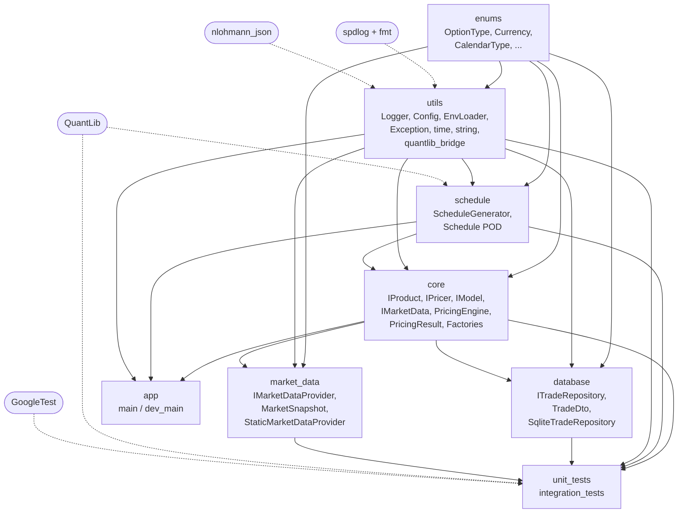
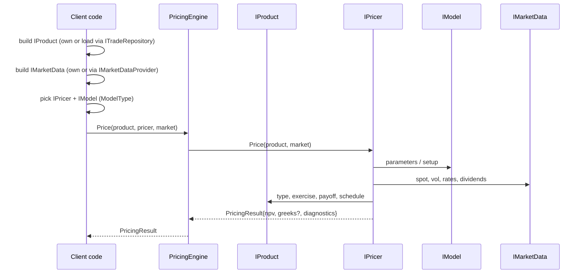
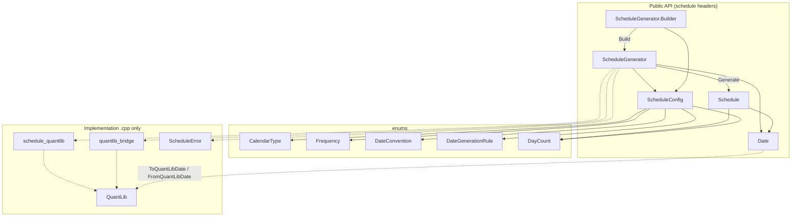
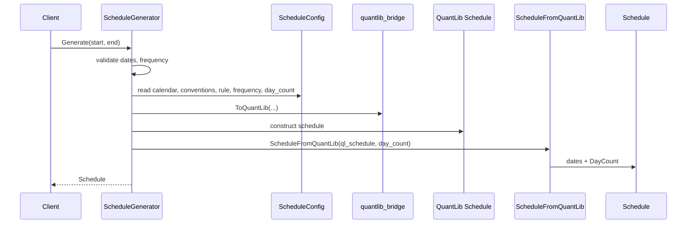
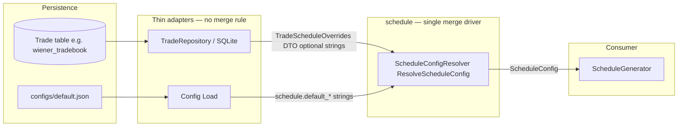
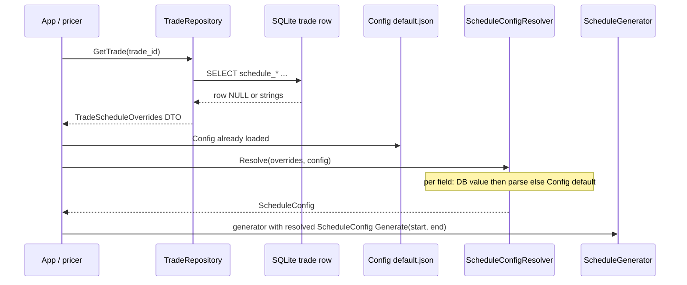
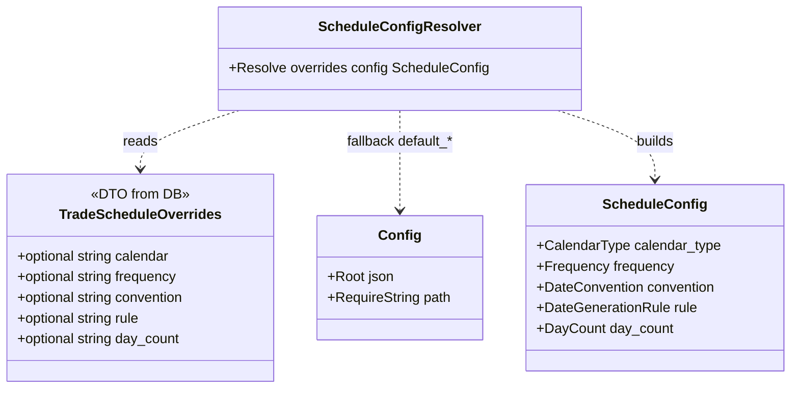
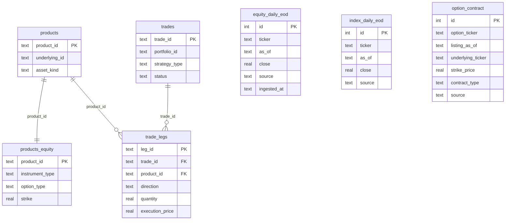
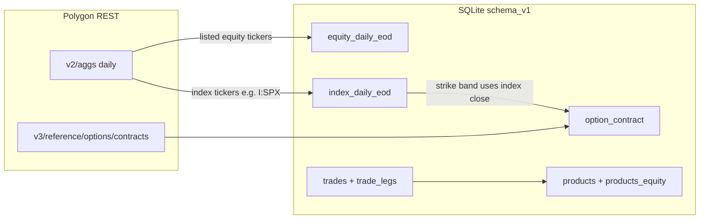
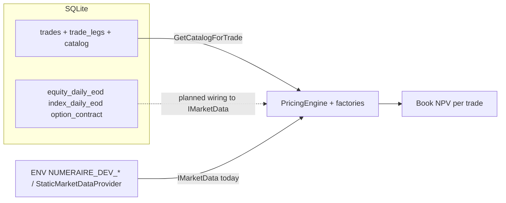

# Numeraire++ — architecture

Living document. Updated as the codebase evolves. **Sprint/stage history:** [`development.md`](development.md).

## Vision

Numeraire++ is a modular C++ derivative pricing framework. The primary goals
are:

- **Composable** — products, pricers, models and market data are independent
  abstractions. You build a trade and pick a pricer per call.
- **Testable end-to-end** — unit tests where possible (everything pure),
  integration tests where I/O is involved (DB, market data providers).
- **QuantLib-grounded** — schedule generation uses QuantLib internally; UTs
  cross-check our outputs against raw QuantLib as the ground truth.
- **Hybrid coupling** — public API speaks our domain types
  (`numeraire::CalendarType`, `Schedule`, `OptionType`); QuantLib lives
  inside the schedule module and inside individual pricers as an
  implementation detail. Bridge helpers in
  `include/numeraire/utils/quantlib_bridge.hpp` (Sprint 1+).

---

## Module dependency graph (target)

Rules:

- `enums` and `utils` are leaf modules — depended on, never depending.
- `core` defines abstractions only; no concrete pricer/product lives here.
- `database` and `market_data` know `core` (they implement / consume its
  interfaces); `core` does not know them.
- QuantLib is visible only in `schedule` (and tests, as a benchmark). `core`
  must never link QuantLib directly.

---

## Pricing flow (target)

---

## Build system

- Top-level [`CMakeLists.txt`](../CMakeLists.txt) is intentionally short. It
  declares the project, options, includes the two helper modules, then
  delegates to per-module subdirectories (gated by `if(EXISTS)` so empty
  modules don't break the build).
- [`cmake/NumeraireCompileOptions.cmake`](../cmake/NumeraireCompileOptions.cmake)
  — language standard, warnings, debug/release flags, OS-specific tweaks.
  Single source of truth for "how we compile".
- [`cmake/NumeraireDependencies.cmake`](../cmake/NumeraireDependencies.cmake)
  — every `find_package` lives here. Single source of truth for "what we
  use". Per-module CMakeLists then link only the deps they actually need.

The first real library is **`numeraire_utils`** ([`src/utils/CMakeLists.txt`](../src/utils/CMakeLists.txt)):
spdlog-backed [`Logger`](../include/numeraire/utils/logger.hpp), log-level
parsing, [`EnvLoader`](../include/numeraire/utils/env_loader.hpp) (dotenv-style
`.env` + optional `ApplyToEnvironment` / POSIX `setenv`), [`Config`](../include/numeraire/utils/config.hpp)
(JSON defaults via nlohmann_json), and the [`exception`](../include/numeraire/utils/exception.hpp)
types. The [`enums`](../include/numeraire/enums/enums.hpp) module holds domain `enum class` types;
[`quantlib_bridge`](../include/numeraire/utils/quantlib_bridge.hpp) maps them to QuantLib calendars,
frequencies, day counters, conventions, currencies, and option/exercise enums. Executables link
`numeraire_utils` directly (which **PUBLIC**-ly depends on `numeraire_enums` and QuantLib).

The **`numeraire_schedule`** library ([`src/schedule/CMakeLists.txt`](../src/schedule/CMakeLists.txt)) wraps
QuantLib schedule generation: [`Schedule`](../include/numeraire/schedule/schedule.hpp) (date list + day-count),
[`ScheduleConfig`](../include/numeraire/schedule/schedule_config.hpp), [`ScheduleGenerator`](../include/numeraire/schedule/schedule_generator.hpp)
(builder + `Generate` / `YearFraction` / `IsBusinessDay` / `Adjust`), plus [`ScheduleToQuantLib`](../include/numeraire/schedule/schedule_quantlib.hpp) /
`ScheduleFromQuantLib`. It links **`numeraire_utils`** for `quantlib_bridge` only (QuantLib stays out of `core`).

### `ScheduleGenerator` dependencies

[`ScheduleGenerator`](../include/numeraire/schedule/schedule_generator.hpp) is a thin façade: it owns a
[`ScheduleConfig`](../include/numeraire/schedule/schedule_config.hpp) (domain enums only in the public header) and,
in the implementation TU, maps that config to QuantLib via [`quantlib_bridge`](../include/numeraire/utils/quantlib_bridge.hpp)
and [`ScheduleFromQuantLib`](../include/numeraire/schedule/schedule_quantlib.hpp). Call sites receive a lightweight
[`Schedule`](../include/numeraire/schedule/schedule.hpp) (dates + `DayCount` tag), not a `QuantLib::Schedule`.

**Types and composition** (solid = header-level ownership / API; dashed = implementation detail in `.cpp`):

**`Generate(start, end)`** (conceptual sequence):

**Pricing takeaway:** keep stochastic models and numerical engines out of `ScheduleGenerator`; pricers consume
`Schedule` / `YearFraction` / `Adjust` alongside `IModel` and market data. Note: [`date.hpp`](../include/numeraire/schedule/date.hpp)
includes QuantLib’s date type for conversions at the schedule module boundary.

### Trade row → `ScheduleConfig` (database first, then JSON fallback)

Schedule fields may live on the trade row (e.g. optional `schedule_*` columns on `wiener_tradebook`). **One place**
must own the merge rule: **use DB strings when present; otherwise fall back to** [`configs/default.json`](../configs/default.json)
under `schedule` (`default_calendar`, `default_frequency`, …), read through [`Config`](../include/numeraire/utils/config.hpp).

- **Persistence** — SQLite (or any repository) returns a small DTO with `std::optional<std::string>` per column; it does **not**
  implement fallback logic.
- **Config** — supplies default strings from JSON; it does **not** know about SQL.
- **`ScheduleConfigResolver` (target)** — lives in the **`schedule`** module; parses optional DB strings to enums and fills gaps
  from `Config`. String→enum parsing stays in the resolver’s `.cpp` (or private helpers), not in thin `enum` headers.

**Component view** (single “driver” for merge):

**Sequence** (conceptual):

**Minimal types** (contract sketch):

---

## SQLite schema & Polygon market-data pipeline *(current stage)*

> **Note:** This subsection describes the **persisted catalog, trades, and market-data tables plus HTTP ingest from Polygon.io** as implemented **today**. It will evolve as DB-backed `IMarketData` and richer surfaces ship. See [`sql/schema_v1.sql`](../sql/schema_v1.sql) for the authoritative DDL.

### Tables at a glance

- **Booking / catalog:** `products`, `products_equity`, `trades`, `trade_legs` — loaded like any repository-backed book (fixtures, migrations, ops tooling).
- **Market history / reference:** `equity_daily_eod`, `index_daily_eod`, `option_contract` — populated by optional Polygon REST jobs run via [`dev_main`](../app/dev_main.cpp).

There are **no foreign keys** from the Polygon-fed tables into `products` / `trades`. Business joins are by convention (e.g. `products.underlying_id` aligned with `equity_daily_eod.ticker`).

### Logical ER diagram

### Polygon.io → SQLite ingest

Bulk endpoints target the same SQLite file configured under `database.path` (see [`configs/default.json`](../configs/default.json)). Credentials and throttle use environment variables (`POLYGON_API_KEY`, optional `POLYGON_BASE_URL`, `NUMERAIRE_POLYGON_SLEEP_SEC_AFTER_CALL`), documented alongside the ingest code under [`src/market_data_providers/`](../src/market_data_providers/).

**Ordering detail:** loading `option_contract` uses an **index level** already present in `index_daily_eod` (e.g. close for strike-window logic). In practice, **ingest index daily EOD before option contract reference** for a given valuation date window.

### From book + market snapshot to NPV *(today’s `dev_main` path)*

Pricing follows the same sequence as **[Pricing flow (target)](#pricing-flow-target)** earlier in this document: `SqliteTradeRepository` assembles a `TradeCatalogBundle` per `trade_id`; `ProductFactory` and `PricingEngine` price each leg.

For market inputs, **`dev_main` currently builds a `MarketSnapshot` and wraps it with `StaticMarketDataProvider`**, with spots, rate, dividend yield, and flat vol driven by environment defaults (`NUMERAIRE_DEV_*`). **Quotes from `equity_daily_eod` are not yet read automatically into `IMarketData`** — persisting Polygon bars lays the groundwork for a future SQLite- or provider-backed implementation of `IMarketDataProvider`.

---

## Delivery status

Sprint checklist, Stage 2 pricing tracks, SQLite/Polygon milestones, and gaps are maintained in **[`development.md`](development.md)** so this file stays focused on structure and diagrams.
