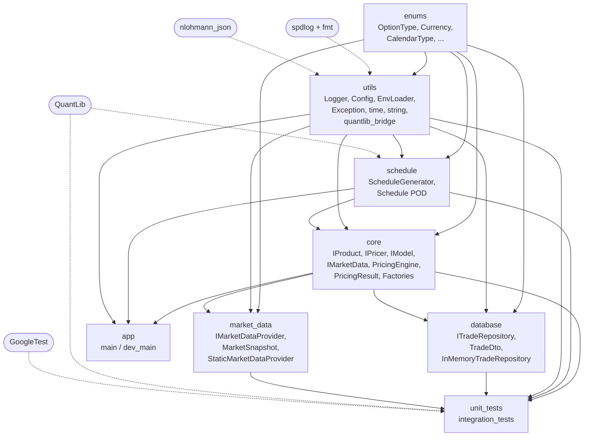
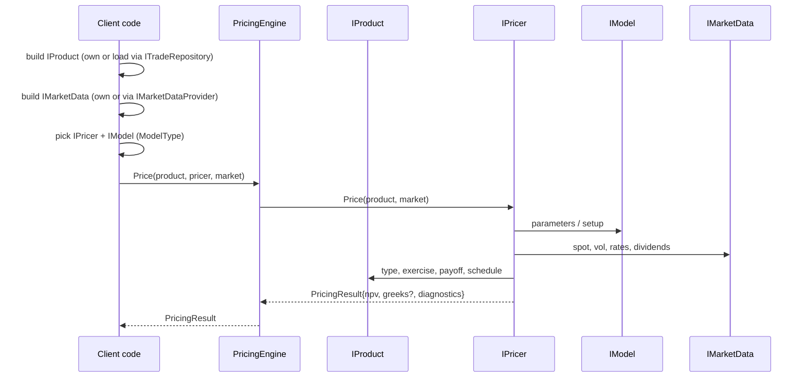

# Numeraire++ — architecture

Living document. Updated as each sprint ships.

## Vision

Numeraire++ is a modular C++ derivative pricing framework. The primary goals
are:

- **Composable** — products, pricers, models and market data are independent
  abstractions. You build a trade and pick a pricer per call.
- **Testable end-to-end** — unit tests where possible (everything pure),
  integration tests where I/O is involved (DB, market data providers).
- **QuantLib-grounded** — schedule generation uses QuantLib internally; UTs
  cross-check our outputs against raw QuantLib as the ground truth.
- **Hybrid coupling** — public API speaks our domain types
  (`numeraire::CalendarType`, `Schedule`, `OptionType`); QuantLib lives
  inside the schedule module and inside individual pricers as an
  implementation detail. Bridge helpers in
  `include/numeraire/utils/quantlib_bridge.hpp` (Sprint 1+).

---

## Module dependency graph (target)

Rules:

- `enums` and `utils` are leaf modules — depended on, never depending.
- `core` defines abstractions only; no concrete pricer/product lives here.
- `database` and `market_data` know `core` (they implement / consume its
  interfaces); `core` does not know them.
- QuantLib is visible only in `schedule` (and tests, as a benchmark). `core`
  must never link QuantLib directly.

---

## Pricing flow (target)

---

## Build system

- Top-level [`CMakeLists.txt`](../CMakeLists.txt) is intentionally short. It
  declares the project, options, includes the two helper modules, then
  delegates to per-module subdirectories (gated by `if(EXISTS)` so empty
  modules don't break the build).
- [`cmake/NumeraireCompileOptions.cmake`](../cmake/NumeraireCompileOptions.cmake)
  — language standard, warnings, debug/release flags, OS-specific tweaks.
  Single source of truth for "how we compile".
- [`cmake/NumeraireDependencies.cmake`](../cmake/NumeraireDependencies.cmake)
  — every `find_package` lives here. Single source of truth for "what we
  use". Per-module CMakeLists then link only the deps they actually need.

The first real library is **`numeraire_utils`** ([`src/utils/CMakeLists.txt`](../src/utils/CMakeLists.txt)):
spdlog-backed [`Logger`](../include/numeraire/utils/logger.hpp), log-level
parsing, [`EnvLoader`](../include/numeraire/utils/env_loader.hpp) (dotenv-style
`.env` + optional `ApplyToEnvironment` / POSIX `setenv`), [`Config`](../include/numeraire/utils/config.hpp)
(JSON defaults via nlohmann_json), and the [`exception`](../include/numeraire/utils/exception.hpp)
types. Executables link this target directly.

---

## Sprint plan (Stage 1)

| Sprint | Deliverables |
|--------|--------------|
| 0 | Build system + layout + style enforcement |
| 1 | `utils`: Logger (spdlog facade), Exception hierarchy (done) |
| 2 | `utils`: EnvLoader, Config (nlohmann_json wrapper) — **done** |
| 3 | `enums` + `utils/quantlib_bridge` |
| 4 | `schedule`: Schedule POD + ScheduleGenerator (QuantLib internally), UT vs raw QuantLib benchmark |
| 5 | `core`: interfaces (IProduct/IPricer/IModel/IMarketData), PricingEngine, PricingResult |
| 6 | `core`: factories (ProductFactory, PricerFactory) |
| 7 | `database`: TradeDto, ITradeRepository, InMemoryTradeRepository (SQLite waits for schema) |
| 8 | `market_data`: MarketSnapshot, IMarketDataProvider, StaticMarketDataProvider (Polygon waits) |
| 9 | Polish: CI, tightening checks as needed |
