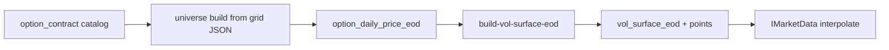

# Implied volatility surface (EOD)

Dedicated reference for how Numeraire++ defines, ingests, builds, and (eventually) consumes **end-of-day implied-volatility surfaces**. For formulas and inversion see [`mathematical_background.md`](mathematical_background.md); for schema columns see [`schema_v1.sql`](../sql/schema_v1.sql); for sprint status see [`development.md`](development.md).

---

## Scope

| In scope | Out of scope (for now) |
|----------|-------------------------|
| EOD sparse surface in `vol_surface_eod` / `vol_surface_point_eod` | Intraday / live surface kinds |
| IV inverted in-app from option closes (Black–Scholes European) | Vendor-supplied IV as primary source |
| Separate **call** and **put** surface legs | Single mid surface published to `IMarketData` |
| Parametric **option universe** before price ingest | Fetching full Polygon chain (~13k contracts/day) |
| Visualization via [`viz/`](../viz/) | Production SVI/SSVI calibration library |

---

## Pipeline (target end state)



**Today:** catalog ingest (full chain), **`--build-option-universe`** → `option_universe_eod`, default price fetch from universe, surface build from prices, and viz are shipped. Interpolation into `IMarketData` is still open.

---

## Data model (SQLite)

- **`vol_surface_eod`** — one header per `(underlying_id, as_of, surface_kind)` with `spot_used`, `risk_free_rate`, `dividend_yield`, model metadata.
- **`vol_surface_point_eod`** — sparse points: `(expiration_date, years_to_maturity, strike, contract_type, implied_vol, quality, …)`.

`underlying_id` follows trade/catalog convention (e.g. `NDX`), not necessarily the Polygon index ticker (`I:NDX`). Spot for build comes from `index_daily_eod` (or configured source).

CLI (when data exists):

```bash
./build/dev_main --build-vol-surface-eod --underlying NDX --from YYYY-MM-DD --to YYYY-MM-DD
```

---

## Conventions

### Moneyness

We specify targets in **percent OTM from spot** (strike space), then map to listed strikes:

| Side | Target strike | Example at S = 28 000, p = 50 |
|------|----------------|--------------------------------|
| OTM **call** | K = S × (1 + p/100) | K = 42 000 |
| OTM **put** | K = S × (1 − p/100) | K = 14 000 |
| **ATM** (p = 0) | K = S | call + put on same listed strike when available |

Equivalent log-moneyness (for code that prefers ln):

- OTM call: ln(K/S) = ln(1 + p/100)
- OTM put: ln(K/S) = ln(1 − p/100)

At **p = 50** (our current outer bound): ln(K/S) ≈ **+0.405** (call) and **−0.693** (put). This is **not** ln = 0.50.

### OTM-only (market standard)

- **Do not** use ITM options for smile points (duplicate information, worse liquidity).
- **Call surface:** points with K ≥ S (p ≥ 0 for OTM calls).
- **Put surface:** points with K ≤ S (p ≥ 0 for OTM puts).
- **ATM:** p = 0; both types allowed (only overlap).

### Expiry pillars

Not every listed expiry (~48/day on NDX) is fetched. For each `listing_as_of`, pick the **nearest listed** `expiration_date` to each target DTE in the grid config (see JSON `expiry_pillars`).

### Strike selection

For each (pillar expiry, OTM percent p, contract type), choose the listed strike minimizing |K − K_target|. Skip the point if the gap is too large versus the local grid step (config: `skip_point_if_strike_gap_exceeds_ratio`).

---

## Parametric universe grid

Authoritative parameters: **[`configs/option_universe_grid.json`](../configs/option_universe_grid.json)**.

Design goals:

1. **Universal across underliers** — same JSON for NDX, SPX, single names; only catalog and spot change.
2. **Denser near ATM**, sparser in the 5–15% “mid” band (interpolation-friendly), **extra wing pillars** approaching **50% OTM** on both sides (safer than the old ±~1% strike band).
3. **Budget-aware** — full catalog is for discovery; universe targets on the order of **hundreds** of contracts per day, not ~13k.

### Expiry pillars (current config)

| id | Target DTE | Tier |
|----|------------|------|
| W1 | 7 | core |
| W2 | 14 | core |
| W3 | 21 | core |
| M1 | 30 | core |
| M1p5 | 45 | core |
| M2 | 60 | core |
| M3 | 90 | core |
| M4 | 120 | core |
| M6 | 180 | core |
| M9 | 270 | core |
| Y1 | 365 | core |
| Y1p5 | 545 | wing |
| Y2 | 730 | wing |

Short end: three weekly-style pillars (7 / 14 / 21) so the dense 0–7d catalog bucket is represented by **representatives**, not every weekly listing.

### OTM moneyness percent (current config)

| Bucket | Percent from spot (each side, OTM) |
|--------|-------------------------------------|
| `atm_dense` | 0, 1, 2, 3 |
| `mid` | 5, 8, 10, 12, 15, 18 |
| `wing` | 20, 25, 30, 35, 38, 40, 42, 45, 46, 48, **50** |

**Wing pillars** (38, 40, 42, 45, 46, 48) are deliberate extra steps before the **50%** cap so interpolation is not stretched over a huge gap.

### Rough cardinality

OTM-only counting (order of magnitude):

- ~13 pillars × ~(2 × 20 − 1) OTM levels + ATM doubles → **~500–650** tickers per `listing_as_of` before skip rules.
- Actual count depends on listed strikes and `skip_point_if_strike_gap_exceeds_ratio`.

If API budget is tight, trim in the order given in JSON `tier_trim_order_when_budget_capped` (wing expiries and furthest OTM first; keep ATM dense on core pillars).

---

## Surface build (IV)

Given `option_daily_price_eod.close` and snapshot spot/rates:

1. Filter to universe tickers (future) or explicit ticker list.
2. Invert European vanilla IV per point ([`ImpliedVolEuropeanVanilla`](../src/quant/implied_vol_european.cpp)).
3. Persist to `vol_surface_point_eod` with `quality` when inversion fails (below intrinsic, bad inputs).

FO vs risk: same math; different price/time inputs are a configuration concern, not a separate schema in v1.

---

## Discovery vs production ingest

| Stage | Purpose |
|-------|---------|
| **Full `option_contract` ingest** | Map chain shape (strike/expiry span, heatmaps). No need to price every row. |
| **Universe from grid JSON** | Controlled Polygon EOD bar ingest. |
| **`build-vol-surface-eod`** | Sparse surface for MTM and viz. |

Heatmap analysis (DTE × |ln(K/S)| buckets) on full catalog informs grid tuning; it does not define grid density.

---

## Visualization

[`viz/notebooks/vol_surface_eod.ipynb`](../viz/notebooks/vol_surface_eod.ipynb) — smiles, term structure, 3D scatter/mesh from SQLite. Mesh interpolation is **viz only**; production `IMarketData` will interpolate in C++ from stored points.

---

## Related files

| File | Role |
|------|------|
| [`configs/option_universe_grid.json`](../configs/option_universe_grid.json) | Parametric pillars + OTM % grid |
| [`sql/schema_v1.sql`](../sql/schema_v1.sql) | `vol_surface_*`, `option_contract`, `option_daily_price_eod` |
| [`docs/mathematical_background.md`](mathematical_background.md) | BS, IV inversion |
| [`src/market_data_providers/polygon_option_contract_fetch.cpp`](../src/market_data_providers/polygon_option_contract_fetch.cpp) | Full-chain catalog ingest |
| [`src/market_data_providers/polygon_option_daily_price_eod_fetch.cpp`](../src/market_data_providers/polygon_option_daily_price_eod_fetch.cpp) | EOD option bars (today: catalog or explicit tickers) |

---

## CLI

```bash
# After index EOD + option_contract for the window:
./build/dev_main --build-option-universe --from 2026-05-01 --to 2026-05-22 --underlying NDX

# Prices for universe only (default); full catalog with --from-catalog:
./build/dev_main --fetch-option-daily-price-eod --from 2026-05-01 --to 2026-05-22 \
  --listing-as-of 2026-05-15 --underlying NDX

./build/dev_main --build-vol-surface-eod --underlying NDX --from 2026-05-01 --to 2026-05-22
```

## Open work

- [x] Job: build universe rows from `option_universe_grid.json` + `option_contract` + spot.
- [x] Price ingest: read universe by default (`--from-catalog` for full catalog).
- [ ] `IMarketData` provider: interpolate `vol_surface_point_eod` for MTM.
- [ ] Optional: per-underlier override JSON (e.g. cap wing % at 35% for single stocks).
